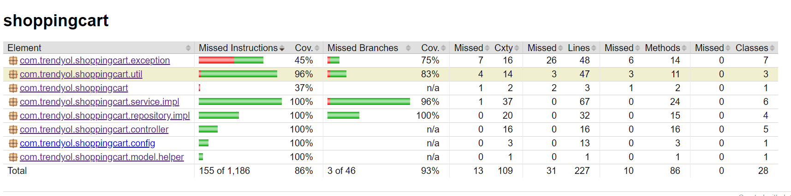
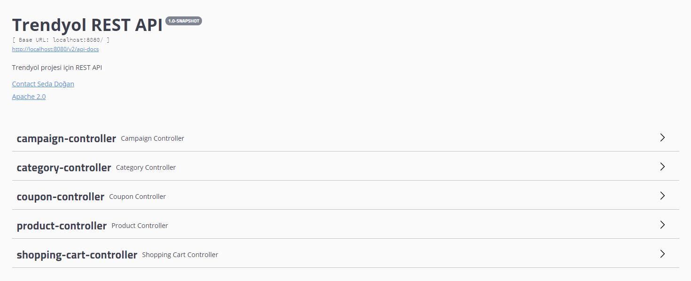

# Shopping Cart App

## Technologies

* Java 1.8
* Spring Boot
* JUnit Jupiter
* Lombok
* Spring Validation
* Spring Web
* Swagger
* Fasterxml Jackson
* Jacoco

### Code Coverage

### Swagger

### Rest URLs
* POST - http://localhost:8080/categoryservice/create
* PUT  - http://localhost:8080/categoryservice/update
* POST - http://localhost:8080/productservice/create
* POST - http://localhost:8080/couponservice/create
* POST - http://localhost:8080/campaignservice/create
* POST - http://localhost:8080/shoppingcartservice/additem/1
* POST - http://localhost:8080/shoppingcartservice/removeitem/1
* GET - http://localhost:8080/shoppingcartservice/deliveryamount
* GET - http://localhost:8080/shoppingcartservice/couponamount
* GET - http://localhost:8080/shoppingcartservice/totalamount
* GET - http://localhost:8080/shoppingcartservice/paymentamount

